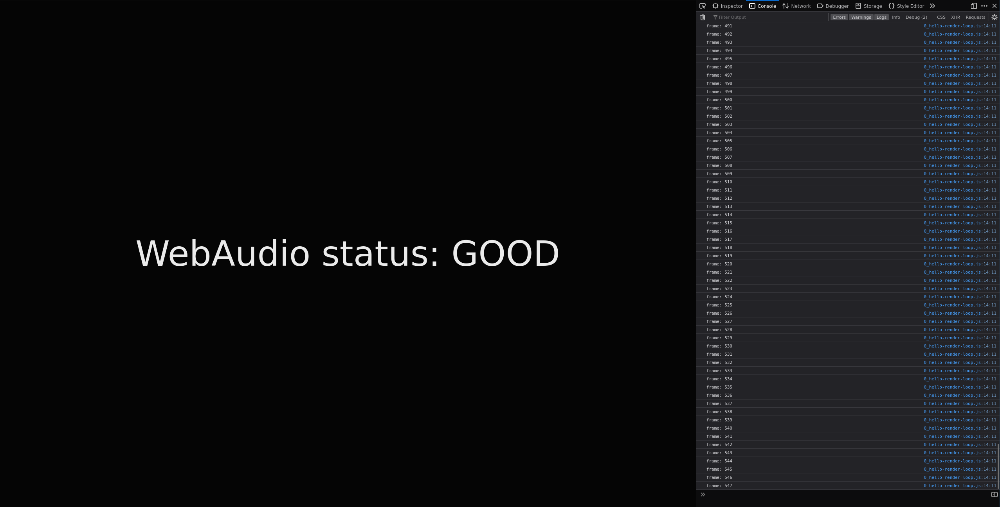

# Step-by-Step Sequencer

Welcome to this fun little workshop where we will go through step-by-step how to build a step sequencer, a little step-by-step sequencer if you will.

A step sequencer is a fun little device that lets you play a sound, either something synthesized or a sample, at a given point in a sequence. The device usually lets you control the tempo, or the ticks, in some way, but other than that they're usually fairly simple things.

Despite being simple, they are a part of the bedrock of musical technology.

The step sequencer we are building today will run in your browser and will let you assign notes to steps in the sequence and control the BPM.

- [Before we start](#before-we-start)
- [I'm stuck or I want to skip ahead](#im-stuck-or-i-want-to-skip-ahead)
- [Step 0: Hello render loop](#hello-render-loop)
- [Step 1: AudioContext \& currentTime](#audiocontext--currenttime)
- [Step 2: Tempo and BPM](#tempo-and-bpm)
- [Step 3: Metronome](#metronome)
- [Step 4: The step in step sequencer](#the-step-in-step-sequencer)
- [Step 5: Beat Matrix](#beat-matrix)
- [BONUS: Playing samples](#bonus-playing-samples)
- [Summary](#summary)

## Before we start

We're going to need three things to get this show on the road:

1. [A recent version of node.js and npm](https://nodejs.org/)
2. A modern browser. I have only tested this in Chrome and Firefox, but Safari and Edge should work in theory.
3. A copy of the code in this repository.

Once you have cloned the repository we can install the dependencies we need with `npm`. Open up a terminal at the projects location and run:

```
npm install
```

This will give us the basic tooling we need to get a development workflow started with `vite` and plain JavaScript.

All the code we are going to be writing today will be in JavaScript. If you want you can write all the code in `index.js`, or you can break things up in modules if that suits you better. `vite` will handle most things fine.

Once you have all the dependencies installed, you can verify that everything is woring fine by running:

```
npm start
```

and open the browser. You should see a page that looks something like this:



If you for some reason don't have WebAudio in your selected browser, try a different one.

The code in this repository is structured as follows:

```
.
├── gfx
├── nuts-and-bolts
├── samples
├── steps
├── index.html
├── index.js
├── package.json
└── README.md
```

`gfx` contains graphics used to illustrate this README.
`nuts-and-bolts` is where you will find some pre-fabricated code that we will be using while building our sequencer.
`samples` contains mp3-samples we're using later.
`steps` contain a working example of the various steps we will be working through, take a look here if you get stuck or want to skip ahead.
`index.html` contains the entry point for our sequencer, you don't have to look in here unless you want to change some styling or try booting up one of the step-solutions.
`index.js` this is where we will be writing our code.
`package.json` is the manifest file, nothing interesting here.
`README.md` the file you are reading right now.

There are some other files aswell, but those can be safely ignored.

## I'm stuck or I want to skip ahead

Inside `index.html` you can will find a reference to a js-file:

```
<script
  type="module"
  src="index.js"
  charset="utf-8"
></script>
```

You can change `index.js` here to point to any of the steps in the `steps/`-folder if you want to use that as a starting point or just see what it does.

If I'm not around physically to help you out, feel free to use the issues in this repo to ask questions and I'll help you as best I can.

## Hello render loop

The first thing we need to do is to set up a render loop which we will use to drive the internal machinery of our step sequencer.

Now that we have a working development environment, let's look at the code in `index.js`:

```
function checkForWebAudio() {
  // This function just prints the WebAudio status,
  // you can safely delete it once you've verified WebAudio works.
}

function frame() {}

function loop() {
  requestAnimationFrame(loop);

  frame();
}

function init() {
  checkForWebAudio();
}

init();
loop();

```

A render loop usually consists of two things:

1. The function you run to initialize the state of your loop.
2. The function you run to kick off your loop.

The first function is called `init` in this example. This is where you place all the things you want to do just once.

The second function is called `loop` in this example. This is where you write the code that you want to do each turn of the loop.

To make the loop go around we need to recursively schedule `loop` to run on the next available Animation frame with [`requestAnimationFrame`](https://developer.mozilla.org/en-US/docs/Web/API/window/requestAnimationFrame).

Something I like to do personally is to make a third function called `frame`. The `frame` function is there only to serve as a place separatly from the looping-mechanics to do whatever you want a frame should be.

These three functions will form the backbone of everything we are going to be doing in this workshop.

### Assignment

Create a `frameCounter` variable that will be logged to the console on each frame and increase by one for each turn of the loop.

#### Hints

Remember to declare the variable in a scope that is accessible from the functions you want to reach it in.

### Why are we doing this?

This is to get you warmed up to the concept of working with a render loop, it will make the later steps easier.

## AudioContext & currentTime

The next thing we need to familiarize ourselves with is the [`AudioContext`](https://developer.mozilla.org/en-US/docs/Web/API/AudioContext) and its clock.

The `AudioContext` is an interface that lets us work with raw audio and audio synthesis in the browser. The thing we are most interested in at this point in our journey is its clock.

The WebAudio clock is a high precision clock with high robustness. This clock is perfect for working with audio, which is a very timing-sensitive domain. It runs in its own thread and is not affected by shennanigans on the main thread.

We can read the current value of this clock by accessing the read only attribute `currentTime` on our context.

When we create a context by calling `new AudioContext()` we get a suspended context. The reason behind this is that browsers no longer allow us to just start playing annoying sounds to a user by just loading a web page, the user actually needs to interact with the page before we're allowed to resume the context.

While the context is suspended the clock is also suspended.

You can test this by logging `audioContext.state` and `audioContext.currentTime` when we initialize our loop.

To actually start the clock we need to resume the context. The way we are going to do this is by using a `button` with a click event handler that calls `audioContext.resume()`.

There is a button you can use in `nuts-and-bolts` called `play-pause.js`, import it by doing:

```
import playPauseButton from "./nuts-and-bolts/play-pause";
```

This gives you a function which takes two functions as arguments. The first one is the `onPlay` callback, the second is the `onPause` callback. You can use these callbacks to do different things when you press Play vs when you press Pause.

### Assignment

Create an audio context and use the `playPauseButton` to resume it's state.

Create a variable to contain the total time passed in the loop. To do this you'll want to keep a record of when the loop got started and then take a reading of the clock on each turn of the loop.

#### Hints

You can (and probably should) pause the audio context by calling `audioContext.suspend()` when pausing. You can always access the current state of the context by checking the read only attribute `state`.

### Why are we doing this?

A high precision and robust timing is neccessary to create audio that is able to keep a steady rythm. The other clocks in the browser are not designed for or suited for this task.

## Tempo and BPM

If you've spent any time with electronic music fans you've probably picked up the term "BPM", it stands for "Beats per Minute" and is a way to measure the tempo of a song.

More traditional schools of music measure tempo using more subjective terms like "adagio" for "slow with great expression" and "allegro" for "fast and bright". In more recent years (1800s onwards, coinciding with the invention of the metronome) these terms have gotten a rough BPM estimate connected to them. See wikipedia for more fascinating info on [Tempo](https://en.wikipedia.org/wiki/Tempo).

We are going to stick with BPM for our purposes, since it is nice and precise which suits our programming brains.

There are a few other things we need to decide aswell. We usually divide a beat into segments or notes. This roughly corresponds to the time signature of sheet music. A "4/4" timesignature indicates we are playing 4 quarter notes per bar. Similarly we can say that we want to play 4 notes per beat, but the length of our notes will be derived from the BPM.

### Assignment

Calculate how long a beat should be and how long each note, or segment, of that beat should be based on your chosen BPM.

Use the length of a beat and the length of a note to calculate which beat number and which note number you have reach given the total time spent in the loop.

Given a BPM of `90` and a `notesPerBeat` of `4` your `beatLength` in seconds should be `0.66666` and your `noteLength` in seconds should be `0.16666`.

#### Hints

Since the Web Audio Clock is given in second-resolution, converting from BPM to BPS will make it easier to work with. You can do that by dividing the BPM value by 60 to make it Beats per Second insead.

To find the beat number given total time and the length of a beat you can do `Math.floor(t / beatLength)`.

To figure out which note of a given beat you are on you can take `noteNumber % numberOfNotesPerBeat` to get a value between `0` and `numberOfNotesPerBeat-1`.

### Why are we doing this?

We usually don't talk about music in terms of which note is played at which second, we usually divide music into beats and then the beats into notes. For instance beat N plays notes X, Y, Z.

Being able to track note and beat numbers makes it a lot easier to work in the same language as music is usually spoken about.

## Metronome

Now that we have a reliable way of counting notes and beats, let's take it a step further and play some sounds on the notes or beats. Let's make a simple metronome.

To play sounds we need a simple synthesizer, fortunatly there is one inside the `nuts-and-bolts`-folder called `simple-synth`. You can import it like this:

```
import SimpleSynth from "./nuts-and-bolts/simple-synth";

const synth = new SimpleSynth(audioContext);
```

When you have a SimpleSynth-instance you can call the `.play()`-method on it, with a note number, a time and a duration. The note number is a number from the midi [note number table](https://studiocode.dev/resources/midi-middle-c/), I would suggest using the number `69` as it is the concert pitch or A4. The time can just be `audioContext.currentTime` and the duration is a number in seconds, `0.25` is probably a good number here.

```
synth.play(69, audioContext.currentTime, 0.25);
```

Another thing a good metronome could use is a way to change the BPM. There is a slider-component in the `nuts-and-bolts`-folder called `bpmInput` which you can use like this:

```
import bpmInput from "./nuts-and-bolts/bpm-input";

// Inside init()
bpmInput(initialBPM, onBPMChange);
```

It takes an initial value and an onChange-input.

### Assignment

Create a metronome that plays a note on each beat and/or each note (up to you, but I'd suggest just sticking to beats).

You're going to need a variable that keeps track of which beat and/or note number you've played so you know when to play the next beat and/or note.

#### Hints

Now would be a good time to create a `resetState()` function that resets the state of your `startTime`-variable and whichever counters you decide to implement. You would then call the `resetState()` function each time something significant changes, like the BPM or when someone presses play.

### Why are we doing this?

Implementing a metronome gives us an idea of how tempo sounds. It also gives us a simpler context for making a synthesizer make sounds.

## The step in step sequencer

Now we've finally arrived at the point where we have all the parts we need to make a simple step sequencer.

To make that happen we need some sort of input to turn steps in our sequence on or off. Luckily, there is some helpful code in the `nuts-and-bolts`-folder. A pad-component called `pad-input` can be used like this:

```
import padInput from "./nuts-and-bolts/pad-input";
```

To use the `padInput` you would need a datastructure to store the state of your pads, an array would be great for this.

```
let pads = Array(16).fill(false)
```

This creates an array with `16` elements all set to `false`. Why `16`? Because that is `4` bars of `4` notes, which is a nice round number. `false` or `true` will indicate wether the pad is turned on or off.

```
// init()
padInput(pads, onClick)
```

The `onClick` callback for the `padInput` will call your callback function with the index of the pad that was clicked, you can then change the state of the pad in question in the callback.

```
function onPadClick(index) {
  pads[index] = !pads[index]
}
```

Now that we have some pads we can turn on or off, let's put them to use.

To implement a step sequencer we only care about notes in groups of `16` (or however long you chose your step sequence to be). To count in groups of `16` we can use the modulo-operator again.

```
let noteInGroupOf16 = noteNumber % 16
```

### Assignment

Change the code so that a note is only played if the pad relevant to the current `beatNumber` is turned on.

#### Hints

To get a visual aid for your step sequencer, add this line of code in your `frame`-function:

```
document.body.dataset["note"] = noteInGroupOf16;
```

and replace `noteInGroupOf16` with the index of the relevant pad.

### Why are we doing this?

This was the goal of this workshop.

## Beat Matrix

We have ourselves a nicely working sequencer, but what if we could make it even more fun?

When I do creative coding projects, like this one, I like to follow a simple workflow:

1. Start with something simple
2. Add parameters to tweak the behavior
3. Multiply!

We've already worked our way through this list once, with the metronome turning into a sequencer. Now, let's multiply again and turn the simple sequencer into a matrix sequencer!

The `padInput` supports taking a 2-dimensional array aswell, so you can do something like this:

```
let pads = [
  Array(16).fill(false),
  Array(16).fill(false),
  Array(16).fill(false),
]
```

to get three rows of pads.

This changes the signature of the `onClick` callback aswell, to give you a `rowIndex` and `columnIndex` instead of just `index`.

Now you can use the row-index as a parameter when checking if a relevant pad is active. You could even add a 2nd synth with a different tune to be the instrument for one of the rows:

```
let synth = new SimpleSynth(audioContext);
let synth2 = new SimpleSynth(audioContext);

synth.envelope(0.25, 0.5, 0.25, 1);
synth2.envelope(0, 0.5, 0, 0);
```

Here we use the `envelope`-method to tweak the sound of the synth. The envelope corresponds to the [ADSR envelope](<https://en.wikipedia.org/wiki/Envelope_(music)#ADSR>).

### Assignment

Add more rows to the sequencer and play around with the tunes each row correspond to.

#### Hints

Have fun with it.

### Why are we doing this?

To have even more fun!

## BONUS: Playing samples

We don't actually have to stick to the SimpleSynth for sound, we could also use samples in the form of `mp3`-files.

In the `samples`-directory you can find files for many different drum sounds.

To load a sample you'll need its location, which you can get like this:

```
import kick from './samples/kick.mp3'
```

which thanks to `vite` gives us a string containing the location of the `kick.mp3` file.

We can then use that string to fetch the sample:

```
let decodedAudioPromise = fetch(kick)
    .then((res) => res.arrayBuffer())
    .then((buf) => audioContext.decodeAudioData(buf))
```

This little dance gives us a promise which will resolve with a decoded audio buffer which we can use to create a function which plays the sample when we need it:

```
decodedAudioPromise.then((val) => {
  samples["kick"] = function () {
    let src = audioContext.createBufferSource();
    src.buffer = val;
    src.connect(audioContext.destination);
    src.start(audioContext.currentTime);
  };
})
```

Here we create a function which we store in a js-object for easy retrieval. The function creates a `BufferSourceNode` which is something in the WebAudioAPI that lets us connect the playback of a buffer to our speakers. We then assign the decoded buffer to the `BufferSource` and connect it to our speakers. We then tell the `BufferSourceNode` to start.

Thanks to the WebAudioAPI this will just get GCed at some point, so there is nothing to worry about by creating lots of `BufferSourceNode`s.

### Samples

Samples are from freesound.org:

- [DWDS'S Deep House Drum kit](https://freesound.org/people/DWSD/packs/11575/?page=1#sound), licensed under Creative Commons Attribution
- [Stomachache's Analog Cymbal](https://freesound.org/people/stomachache/sounds/140153/), license under Creative Commons 0.
- [Karman Lyne's 808 toms](https://freesound.org/people/Karman_Lyne/sounds/520168/), license under Creative Commons 0.

Kudos to [teropa/drumkit](https://github.com/teropa/drumkit) for the collection.

## Summary

Thank you for completing the workshop, I hope you had fun!

We now have a simple sequencer, a way to create silly little tunes. But where do you go from here? Here are some ideas:

- Implement a more sophisticated Synthesizer with more voices and parameters.
- Add more features to the UI. Like the ability to assign instruments or samples to specific rows.
- Add a MIDI controller using the WebMIDI API, so you don't have to click.
- Turn the sequencer into a [tracker](https://en.wikipedia.org/wiki/Music_tracker). A tracker can be thought of as a sequencer that doesn't loop back, but instead moves to the next "page".
